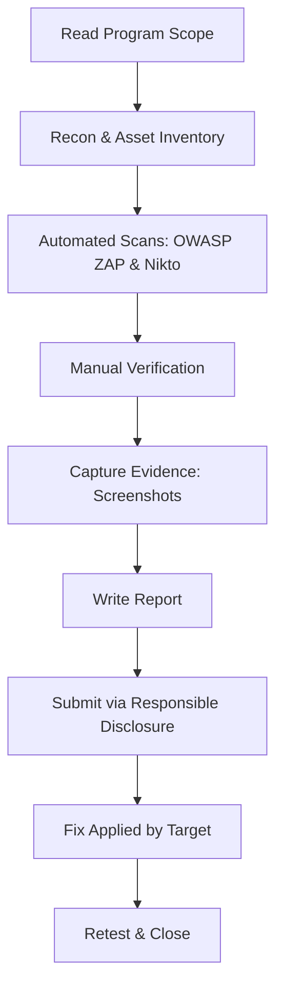

# Bug Bounty Vulnerabilities Scanning

> Educational repository showcasing a full bug bounty scanning workflow using OWASP ZAP, Nikto, and responsible disclosure practices. Includes report templates, evidence capture tips, and automation ideas.

<p align="center">
  <a href="https://github.com/AkilaSandeepa"></a>
  <a href="https://github.com/AkilaSandeepa"></a>
  <a href="https://github.com/AkilaSandeepa"></a>
  <a href="https://github.com/AkilaSandeepa"></a>
  <a href="https://github.com/AkilaSandeepa"></a>
</p>

---

## 📌 Overview
This repository contains a structured, ethical walkthrough of web vulnerability scanning and reporting based on the examples from `Bug-bounty-vulnerabilities-scanning.pdf`. It includes:

- A professional **reporting template** and **example reports** from the PDF.
- **Evidence assets** (screenshots) with clear naming.
- Command snippets for **OWASP ZAP** and **Nikto**.
- A reproducible **workflow** diagram and a **checklist** for submissions.

> ⚠️ **Disclaimer:** All activities MUST follow the target program’s policy scope and lawful, written authorization (e.g., via HackerOne/Bugcrowd). This repo is for **education**. Do not test outside allowed scope.

---

## 🗂️ Repository Structure
```
.
├── assets/
│   └── images/
│       ├── poc-01.png
│       ├── poc-02.png
│       └── ...
├── reports/
│   ├── 01-pii-disclosure-1password.md
│   ├── 02-sql-injection-crowdstrike.md
│   ├── 03-vuln-js-gitlab-axios.md
│   ├── 04-sql-injection-silabs.md
│   ├── 05-hidden-hg-temu.md
│   ├── 06-missing-csrf-paypal.md
│   ├── 07-csp-misconfig-snapchat.md
│   ├── 08-missing-csp-netflix.md
│   ├── 09-csp-wildcards-whoop.md
│   └── 10-cors-misconfig-zooplus.md
├── templates/
│   └── report-template.md
├── tools/
│   ├── zap-quickscan.md
│   └── nikto-quickscan.md
├── README.md
└── Bug-bounty-vulnerabilities-scanning.pdf
```

---

## 🎯 Goals
- Practice **safe** web reconnaissance and scanning.
- Produce **clear, reproducible** bug reports with strong evidence.
- Learn to **triage** findings and propose **effective mitigations**.

---

## 🚀 Quick Start
```bash
# clone your repo
git clone https://github.com/AkilaSandeepa/<your-repo>.git
cd <your-repo>

# create folders for assets
mkdir -p assets/images reports templates tools
```
Add screenshots from the PDF into `assets/images/` and write detailed reports in `reports/` using the template.

---

## 🧭 Workflow


---

## 📄 Reports Index (from PDF)
| #  | Finding (Short)                     | Target / Area                                        | Severity | Evidence |
|----|-------------------------------------|-------------------------------------------------------|----------|----------|
| 01 | PII disclosure in response          | 1password.com (compare page)                          | High     | img      |
| 02 | SQL Injection (time-based, SQLite)  | crowdstrike.com (ESG page param)                       | High     | img      |
| 03 | Vulnerable JS lib (Axios v1.6.8)    | about.gitlab.com `_nuxt/dd53a18.js`                    | High     | img      |
| 04 | SQL Injection (time-based, Oracle)  | community.silabs.com `/s/sfsites/`                     | High     | img      |
| 05 | Hidden VCS `.hg` disclosure         | temu.com                                              | Medium   | img      |
| 06 | Missing anti-CSRF tokens            | paypal.com (password recovery form)                   | Medium   | img      |
| 07 | CSP misconfig (no fallback)         | snapchat.com                                          | Medium   | img      |
| 08 | Missing CSP header                  | netflix.com                                           | Medium   | img      |
| 09 | CSP wildcards & unsafe sources      | whoop.com `/en/difference/`                           | Medium   | img      |
| 10 | Permissive CORS `*`                 | zooplus.de                                            | Medium   | img      |

---

## 🧰 Tooling Cheatsheets
### OWASP ZAP (Docker quick scan)
```bash
docker run --rm -t owasp/zap2docker-stable zap-baseline.py   -t https://example.com   -r zap-report.html   -z "-config api.disablekey=true"
```

### Nikto
```bash
nikto -h https://example.com -o nikto-report.txt
```

---

## 🧾 Report Template (quick view)
See `templates/report-template.md`. Suggested sections:
- Title & Severity
- Target Program & Scope Link
- Summary
- Affected Components / URLs
- Technical Details (CWE/OWASP mapping)
- Impact Assessment
- Steps to Reproduce
- Proof of Concept (images)
- Mitigation / Fix
- References

---

## 🔒 Ethics & Legal
All testing must be **authorized**. Follow local laws and platform rules. This repository is intended for **learning and portfolio** use.

---

## 🪪 License
MIT — see `LICENSE`.

---

## 📚 Related
- `Bug-bounty-vulnerabilities-scanning.pdf` — original compiled document
